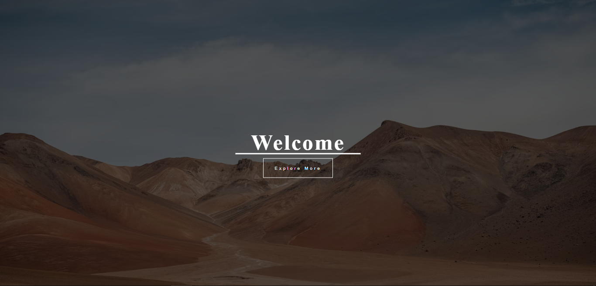
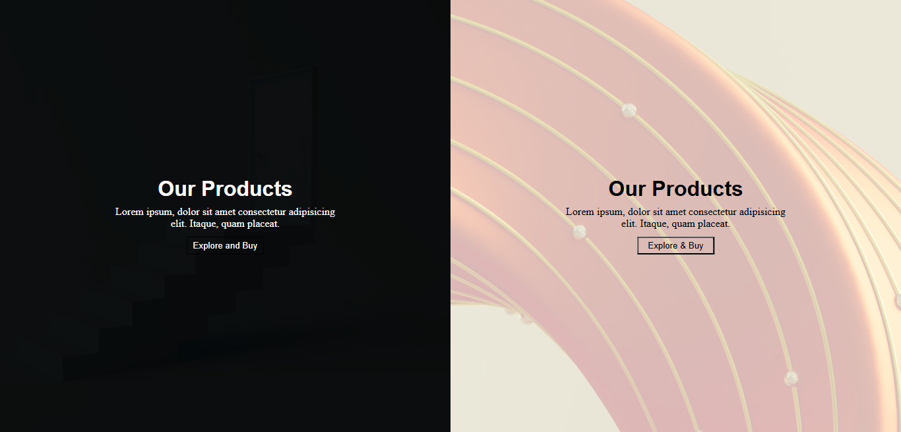
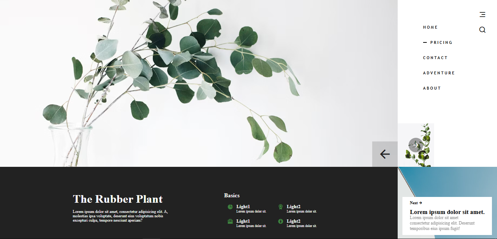
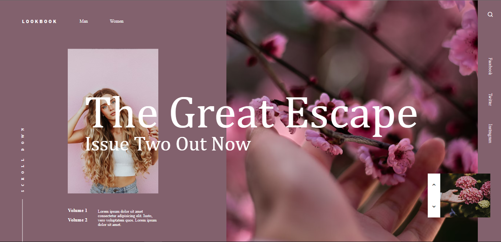
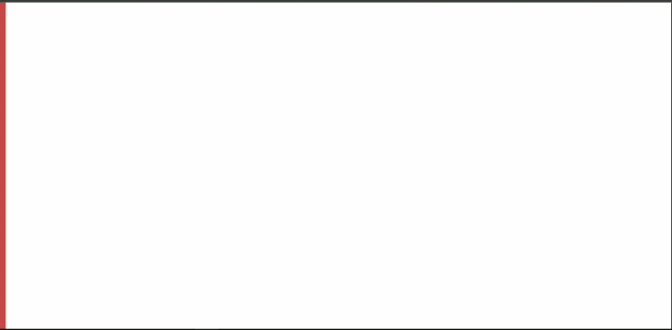

# Frontend Learning Projects
Welcome to my collection of frontend learning projects! This repository contains a variety of small applications built to practice and demonstrate fundamental concepts of HTML and CSS. One of the projects also incorporates JavaScript for animations.

## Projects
Here's a list of the projects included in this repository:

* [1st Project: Landing Page](#1-1st-project-landing-page)
* [2nd Project: Split Screen Landing Page](#2-2nd-project-split-screen-landing-page)
* [3rd Project: Plant Details Page](#3-3rd-project-plant-details-page)
* [4th Project: Fashion Lookbook](#4-4th-project-fashion-lookbook)
* [5th Project: Nike Product Page with GSAP](#5-5th-project-nike-product-page-with-gsap)

---

### 1. 1st Project: Landing Page
A simple and elegant landing page featuring a full-screen background image with a semi-transparent overlay. Centered on the page are a welcoming text and an "Explore More" button, creating a clean and focused user experience.

**Screenshot**

---

### 2. 2nd Project: Split Screen Landing Page
This project showcases a split-screen layout, dividing the page into two vertical sections. Each side features a different background image and a content overlay with a title, descriptive text, and a call-to-action button, offering a visually appealing way to present dual options or products.

**Screenshot**

---

### 3. 3rd Project: Plant Details Page
A visually rich page layout designed to provide detailed information about a plant. The design is split into a large image section on the left and a content-heavy section on the right, which includes navigation, icons, and descriptive text within a clean, card-based layout.

**Screenshot**

---

### 4. 4th Project: Fashion Lookbook
A sophisticated and modern layout for a fashion lookbook. This project uses a three-column design with a central image, flanked by text and navigation elements. It features a creative use of typography and positioning to create a high-fashion feel.

**Screenshot**

---

### 5. 5th Project: Nike Product Page with GSAP
An animated product page for a pair of Nike shoes. This project leverages the GreenSock Animation Platform (GSAP) to create smooth, engaging animations for the product image and text elements, providing a dynamic and interactive user experience.

**Animation**

---

## Technologies Used
* HTML5
* CSS3
* JavaScript (in the 5th project)
* GSAP (GreenSock Animation Platform)

## How to Run
No special setup is required. To view any of these projects:

1.  Clone this repository.
2.  Navigate into the specific project's directory (e.g., `1st/`, `2nd/`, etc.).
3.  Open the `index.html` or corresponding `.html` file in your web browser.